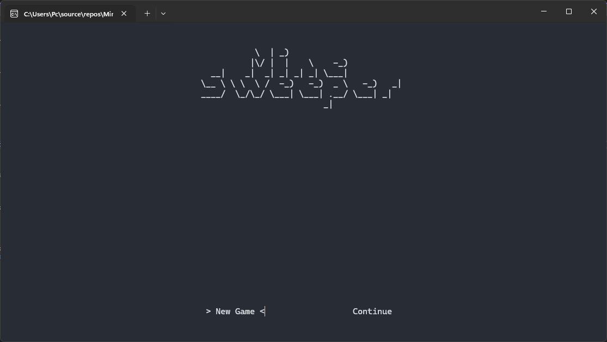
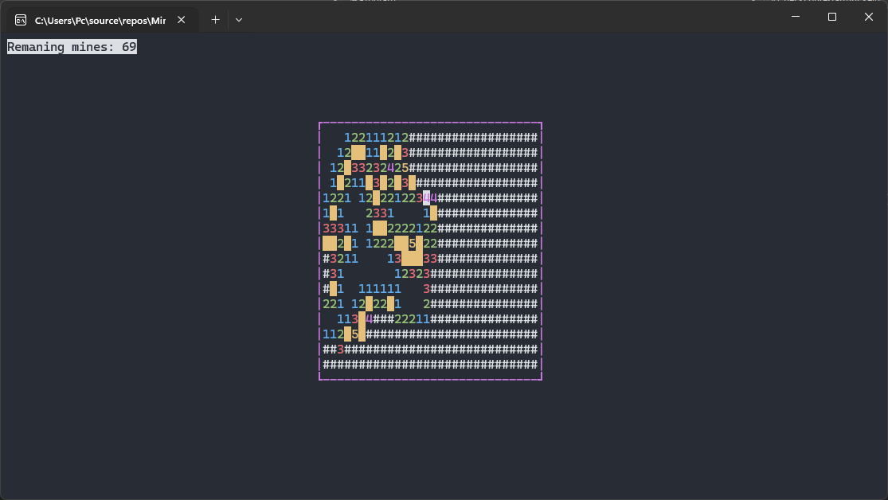

<!-- markdownlint-disable MD033 -->

# Minesweeper




A simple TUI Minesweeper clone written in C# using the [dotnet-curses](https://github.com/MV10/dotnet-curses) .NET wrapper for the [ncurses](https://invisible-island.net/ncurses/) library.

## Installation

### Prerequisites

- Install the .NET SDK (9.0 or later): <https://dotnet.microsoft.com/download>
- On Linux/macOS ensure the system ncurses library is available (e.g. `libncurses` / `ncurses-devel`).

### Build and run

Open a command line and type these commands line by line:

```bash
git clone https://github.com/Ibrahimbag/Minesweeper.git
cd Minesweeper/Minesweeper
dotnet build --configuration Release
dotnet run

# Or run the compiled binary:
# Windows: Minesweeper\bin\Release\net9.0\Minesweeper.exe
# Linux/macOS: ./Minesweeper/bin/Release/net9.0/Minesweeper
```

## Usage

Start your built game by using the ```dotnet run``` command or running the compiled binary.

<kbd>Arrow</kbd> keys for option navigation and tile navigation.\
<kbd>ENTER</kbd> key to choose an option.\
<kbd>SPACE</kbd> key to open a tile.\
<kbd>F</kbd> key to flag a tile.\
<kbd>S</kbd> key to save your progress in a file named "save.json" in the working directory.

## Notes

- If you encounter terminal/color issues, ensure your terminal supports the required features or try a different terminal emulator.
