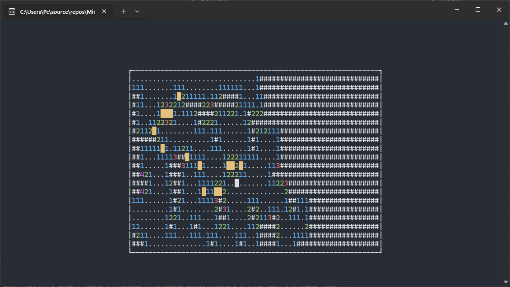

<!-- markdownlint-disable MD033 -->

# Minesweeper

A simple TUI Minesweeper clone written in C# using the [dotnet-curses](https://github.com/MV10/dotnet-curses) .NET wrapper for the [ncurses](https://invisible-island.net/ncurses/) library.
